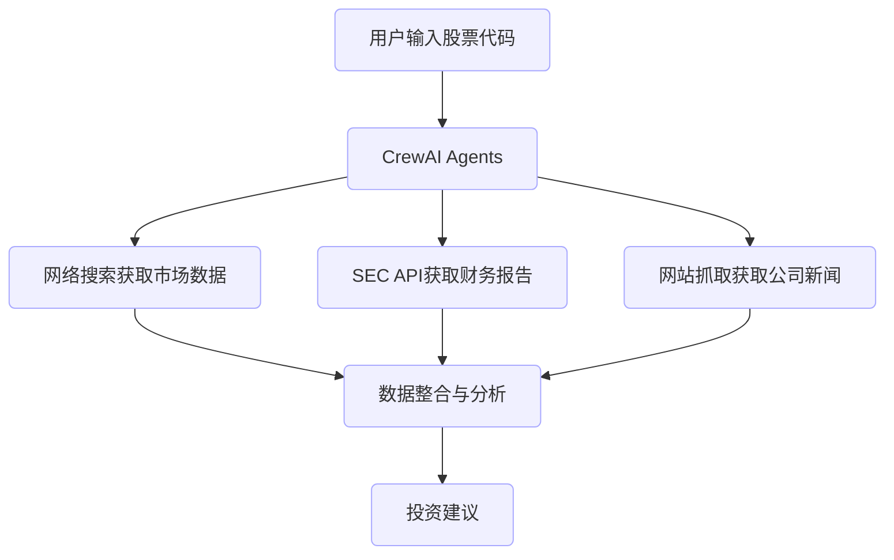

项目概述

这是一个利用多智能体系统进行自动化股票分析的高级工具。该项目基于CrewAI框架构建，实现了一个由多个专业"智能体"（AI Agents）组成的协作团队，能够自动收集、分析并提供关于特定股票的全面投资建议。

核心技术

CrewAI框架: 用于编排多个自主智能体的协作

大型语言模型: 使用DeepSeek等先进的大型语言模型作为智能体的推理引擎

SEC EDGAR数据分析: 自动分析公司的10-K和10-Q报告

网络搜索与内容抓取: 收集最新的公司新闻和市场情绪

金融数据API集成: 收集和处理实时股票和财务数据

系统架构
该系统由三个主要智能体组成，每个智能体都有其特定的角色和专业知识：

财务分析师 (Financial Analyst): 负责分析公司的财务健康状况和市场表现

研究分析师 (Research Analyst): 收集和总结相关的新闻文章、新闻发布和市场分析

投资顾问 (Investment Advisor): 综合前两位分析师的见解，形成投资建议

工作流程如下:

项目特点

自动化数据收集: 无需手动搜索财务数据和新闻

深入分析: 提供全面的财务指标、竞争分析和市场趋势

文档解析: 自动分析SEC EDGAR文档中的关键信息

自适应研究: 智能体会根据公司和行业自动调整其研究方向

格式化报告: 生成结构良好、易于理解的投资报告

可扩展架构: 轻松添加新的智能体或分析工具

技术亮点

智能体协作框架: 实现了基于角色的AI智能体协作系统

大型语言模型集成: 使用DeepSeek模型增强分析能力

高效API管理: 整合多个金融数据服务API

SEC文档语义搜索: 实现对冗长财务文件的精确查询

事件驱动架构: 使用CrewAI的事件系统实现精确的工作流程控制

案例展示
以下是系统生成的Amazon (AMZN) 股票分析报告示例:
# 投资建议: Amazon (AMZN)

## 执行摘要
基于全面的财务分析、市场研究和SEC文件评估，我们建议对Amazon (AMZN)股票持**买入**立场，预计12个月目标价为$200，潜在上涨空间20%。

## 财务健康状况
Amazon展示了强劲的财务基本面，营收同比增长11.4%，达到1430亿美元。云计算业务AWS继续作为主要增长驱动因素，增长32%。

- **盈利能力**：营业利润率提升至7.8%，较去年同期提高2.1个百分点
- **现金流**：自由现金流增长至252亿美元，同比增长45%
- **资产负债表**：持有673亿美元现金及等价物，长期债务保持在稳健水平

## 市场定位与竞争分析
Amazon在电子商务、云计算和数字内容领域保持领先地位：

1. **电子商务**：全球市场份额约40%，Prime会员持续增长
2. **云计算**：AWS保持34%市场份额，领先Microsoft Azure和Google Cloud
3. **数字内容**：Prime Video和Music服务用户增长迅速

## 近期发展与未来机会
- AI集成为各业务线带来新增长机会
- 物流网络优化减少配送时间并降低成本
- 国际市场（特别是印度和拉丁美洲）显示强劲增长潜力
- 医疗保健领域扩张通过Amazon Pharmacy和远程医疗服务

## 风险因素
- 监管压力可能影响业务扩张
- 劳动力成本上升
- 激烈的竞争环境
- 宏观经济不确定性

## 投资建议
基于公司强劲的财务状况、市场领导地位和创新能力，我们对Amazon (AMZN)股票给予**买入**评级，12个月目标价$200。

投资者应关注下一季度财报中AWS增长率和利润率指标，作为投资决策的关键指标。